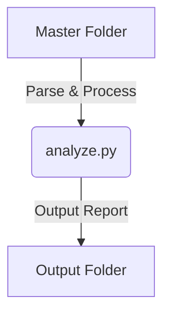

# Technical Documentation: Delivery Protocol Analyzer

This document provides end-to-end technical documentation for developers maintaining, configuring, or redeploying the **Delivery Protocol Analyzer** program.

---

## 1. Architectural Overview

The program is a modular, layout-tolerant Python CLI script (`analyze.py`) designed to scan, parse, and analyze smelter sampling protocols in PDF format, outputting the results into an Excel-ready semicolon-delimited CSV spreadsheet.

### 1.1 The Safe Folder Contract
To protect billing databases from corruption or accidental loss, the program enforces a strict 2-folder pipeline:
1. **Master Folder (`MASTER_FOLDER`)**: The baseline database of original supplier documents. **Never modified.** The script strictly reads data directly from here.
2. **Output Folder (`OUTPUT_FOLDER`)**: The destination directory for the final CSV reports.



### 1.2 Traversal Logic and Smelter Code Derivation
The script traverses the directory structure using the contract:
`{MASTER_FOLDER}/{SupplierName}/{Year}/{Month}/{DeliveryNumber}/`

* **Smelter Code Logic**: The hute/smelter code is calculated based on the delivery folder name. If the delivery folder name starts with the last 2 digits of the Year folder (e.g. Year `2026` and Delivery `26002238`), the smelter code is assigned as `BRX` (Brixlegg). Otherwise, it defaults to `KK` (Kovohuty).

---

## 2. Multilingual PDF Parsing Engine

The extraction logic uses `pdfplumber` to extract page text as a raw string and processes it using regex patterns. Because documents originate from different countries (Slovakia, Austria, Germany), the vocabulary parser is built to be multilingual and layout-tolerant.

### 2.1 Multilingual RegEx Vocabulary
The parser maps the three critical weight/moisture fields across English, German, and Slovakian:

| Field | Target Language | Regex Synonyms & Accent Classes |
|---|---|---|
| **Wet Weight** | EN · DE · SK | `Wet weight`, `Nassgewicht`, `mokrá/vlhká hmotnosť`, `Feuchtgewicht`, `hmotnosť za mokra` |
| **Moisture** | EN · DE · SK | `Moisture`, `Nässe`, `Feuchtigkeit`, `Feuchte`, `vlhkosť` |
| **Dry Weight** | EN · DE · SK | `Dry weight`, `Trockengewicht`, `suchá hmotnosť`, `sušina`, `hmotnosť za sucha` |

* **Accent resilience**: Character classes like `[aá]`, `[tť]`, and `[sš]` ensure that even if the PDF text is extracted with broken character encodings or without accents (due to layout anomalies), it still matches.
* **Unit and spacing tolerance**: Patterns like `(?:[ \t]*\[?kg\]?)?[ \t]*:[ \t]*([\d.,]+)` make the brackets and units optional, tolerating different spacing and separators (e.g., `Wet weight: 1.23` vs `Nassgewicht [kg] : 1.23`).

### 2.2 Date and Position Disambiguation
* **Date Selection**: Every PDF has multiple date fields (`Date of receipt:` and `Date:`). The parser uses `re.findall` to find specific labels like `Date of receipt` or `Eingangsdatum`. If not found, it falls back to capturing the first `DD.MM.YYYY` date found in the text. This replaces the previous logic which relied on the finalization date (`Date:` or `Datum:`).
* **Non-Halting Strategy**: Previously, a parse error on a single corrupt or empty PDF would halt the entire script execution. The engine now operates on a **non-halting fail-safe strategy**: if extraction fails, it logs `[FAIL]` with a specific reason, increments `protocols_failed`, and continues processing the rest of the folders.

---

## 3. Developer Environment Setup

### 3.1 Dependencies
The script has two dependencies outside of the Python standard library:
1. `pdfplumber` (for PDF text layout extraction)
2. `rich` (for colored, formatted terminal output and logs)

These are managed in the `requirements.txt` file:
```text
pdfplumber>=0.11.0
rich>=13.7.0
```

### 3.2 Virtual Environment Management (Cross-Platform)

Always configure and use a virtual environment (`venv`) to prevent packages from conflicting with the system Python interpreter.

#### macOS / Linux
```bash
# Create the environment
python3 -m venv venv

# Activate the environment
source venv/bin/activate

# Install dependencies
pip install -r requirements.txt
```

#### Windows (Command Prompt / CMD)
```cmd
:: Create the environment
python -m venv venv

:: Activate the environment
venv\Scripts\activate.bat

:: Install dependencies
pip install -r requirements.txt
```

#### Windows (PowerShell)
```powershell
# Create the environment
python -m venv venv

# Activate the environment
.\venv\Scripts\Activate.ps1

# Install dependencies
pip install -r requirements.txt
```

---

## 4. OS-Specific Configuration Rules

When moving the script between macOS and Windows, follow these path-handling and execution guidelines:

### 4.1 Path Formats
* **macOS/Linux**: Paths use forward slashes (e.g., `/Users/MIESZKO/...`).
* **Windows**: Paths use backslashes (e.g., `C:\Users\MIESZKO\...`). 
* **Raw String Prefix**: On Windows, Python interprets backslashes (`\`) as escape characters (e.g., `\u` or `\t`). You **must** prefix all Windows paths with `r` (raw string literal):
  ```python
  OUTPUT_FOLDER = r"C:\Users\MIESZKO\output-protocols-analyzed"
  ```
* **Pathlib Usage**: Inside the code, all path manipulations use `pathlib.Path` objects rather than string concatenations. This guarantees that file paths are resolved using the native OS separator dynamically.

### 4.2 Terminal Encodings (Windows UTF-8 Console)
By default, the Windows Command Prompt does not use UTF-8 (`cp65001`), which causes Polish accented characters and Rich terminal borders to display as corrupted characters. 
* To fix this, change the console active page code to UTF-8 before running the script:
  ```cmd
  chcp 65001
  python analyze.py
  ```

---

## 5. Troubleshooting & Diagnostics

Below is a catalog of common developer/user issues, their root causes, and how to fix them.

### 5.1 "Missing dependencies" / "ModuleNotFoundError"
* **Symptom**: The script prints `Błąd: Brakujące zależności. Uruchom 'pip install -r requirements.txt'` and exits.
* **Root Cause**: The script was executed using the global system Python instead of the virtual environment interpreter.
* **Fix**: Ensure you have activated the virtual environment (`source venv/bin/activate` or `venv\Scripts\activate`) before running, or execute it directly using `./venv/bin/python analyze.py`.

### 5.2 IDE/Editor Import Warnings (Squiggly Lines)
* **Symptom**: Editor (Cursor, VS Code, PyCharm) flags imports like `import pdfplumber` or `import rich` as missing, even though the script runs fine in the terminal.
* **Root Cause**: The IDE's default python linter is pointed to the system global interpreter instead of the project venv.
* **Fix**: Open the Command Palette (`Cmd + Shift + P` or `Ctrl + Shift + P`), select **`Python: Select Interpreter`**, and choose the interpreter inside the local `venv/` directory.

### 5.3 Preflight Failsafe: "Folder główny (Master) jest pusty"
* **Symptom**: The preflight check halts with `Folder główny (Master) jest pusty: {path}`.
* **Root Cause**: The `MASTER_FOLDER` directory is empty.
* **Fix**: Ensure the original database files are present in the Master directory.

### 5.5 Semicolon CSV opens in a single column in Excel
* **Symptom**: The output `.csv` file is opened in Excel, but all data appears squeezed into a single column separated by semicolons.
* **Root Cause**: The user's Excel settings/OS region is configured to expect commas `,` as delimiters instead of semicolons `;` (common in US-based locales).
* **Fix**: 
  1. Open a blank workbook in Excel.
  2. Go to **Data** → **Get Data (From Text/CSV)**.
  3. Select the file, change the delimiter to **Semicolon**, and import.
  4. (Alternative): Change the system regional settings list separator to `;` in the operating system's Control Panel.
